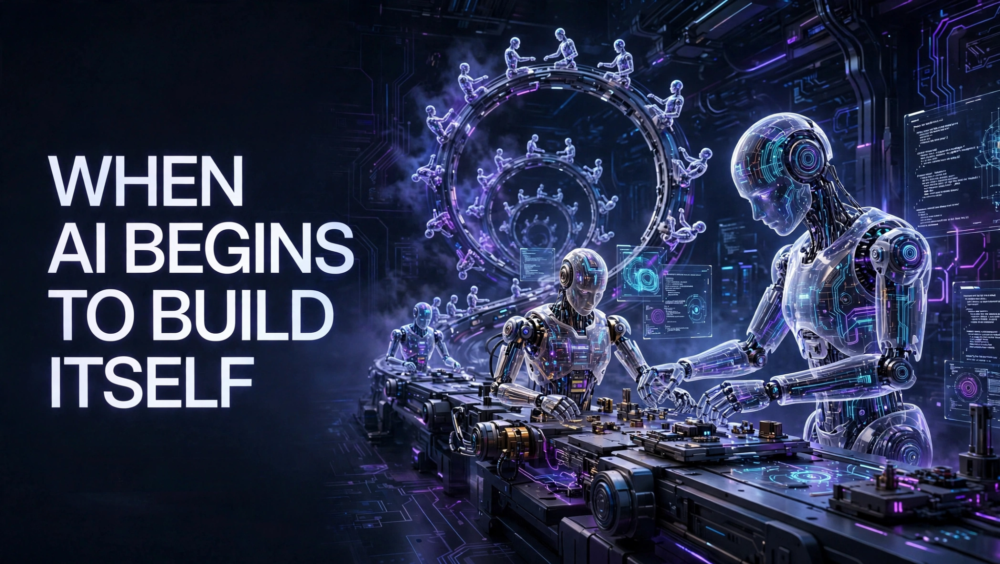

*AI-generated cover illustration created under the creative direction of Aridio Silva, September 2026. Used as a conceptual representation of recursive AI development.*

# When AI Begins to Build Itself

## An Academic and Didactic Analysis of *When AI Builds Itself: Our Progress Toward Recursive Self-Improvement, and Its Implications*

**Author:** Aridio Silva  
**ORCID:** https://orcid.org/0009-0008-2411-6995  
**Edition:** English edition prepared for open-access deposit  
**Date:** September 2026

---

## Abstract

The Anthropic Institute article *When AI Builds Itself* argues that artificial intelligence has begun to materially accelerate the development of new AI systems. AI agents increasingly contribute to programming, experimentation, debugging, evaluation, and research, creating the possibility of a cumulative feedback loop: better models help researchers build still better models, which may in turn accelerate the production of their successors. The article does not claim that full recursive self-improvement has already been achieved or that it is inevitable. Rather, it presents evidence that portions of the AI research and development cycle are progressively being automated.

This paper offers an academic and didactic analysis of that thesis. It distinguishes AI-assisted R&D from full recursive self-improvement, examines the public benchmarks and internal evidence cited by Anthropic, identifies methodological limitations and unresolved logical steps, and discusses implications for scientific practice, organizational design, human expertise, AI safety, and governance. The evidence strongly supports the narrower conclusion that AI already accelerates important parts of AI development. It does not yet demonstrate that present systems can autonomously select consequential research goals, validate results, design superior successors, or safely close the entire improvement loop. The central governance challenge is therefore not only whether AI will build itself, but whether institutions can preserve the capacity to understand, verify, and control an increasingly automated development cycle.

**Keywords:** artificial intelligence; autonomous agents; recursive self-improvement; automated research; AI governance; AI safety; human oversight; research automation.

---

## 1. Introduction

For most of the history of artificial intelligence, humans controlled every major stage of AI development. Researchers formulated hypotheses, engineers wrote the code, teams conducted experiments, specialists interpreted results, and institutions decided which systems should be trained and deployed.

That arrangement is beginning to change.

In *When AI Builds Itself: Our Progress Toward Recursive Self-Improvement, and Its Implications*, Marina Favaro and Jack Clark of the Anthropic Institute present evidence that AI systems are already participating in the creation of new AI systems. Coding agents write and modify production code, execute tools, debug complex failures, optimize experimental pipelines, propose research steps, and coordinate work across multiple agents.

The central claim deserves careful treatment:

> AI does not yet autonomously develop its own successors, but it already accelerates the research and engineering processes through which those successors are built.

This distinction is essential. Full recursive self-improvement has not been empirically demonstrated. Nevertheless, the technical and organizational infrastructure required for it may be emerging through the gradual automation of the AI research and development cycle.

The Anthropic text is best understood as an evidence-informed institutional essay rather than a conventional peer-reviewed article. It combines public benchmarks, internal operational data, experimental results, employee reports, and scenario analysis. Its practical relevance is considerable, but portions of its evidence cannot yet be fully audited or independently reproduced.

## 2. The Central Thesis

The article's thesis can be reconstructed as a five-step argument:

1. AI performs a growing share of engineering and research work.
2. This automation increases the speed and scale of AI R&D.
3. Faster R&D produces more capable systems in less time.
4. More capable systems can further accelerate the development of the next generation.
5. If goal selection, scientific judgment, validation, and strategic direction also become automated, the development loop may become autonomous and recursive.

The article's main conceptual contribution is to describe recursive self-improvement as the gradual closing of an R&D loop, rather than necessarily as a sudden event in which a machine directly rewrites its own intelligence.

## 3. What Recursive Self-Improvement Means

Three stages should be distinguished:

| Stage | Role of AI | Role of humans |
|---|---|---|
| AI as a tool | Suggests code, explains problems, and assists with bounded tasks | Defines and executes the overall process |
| AI-accelerated R&D | Implements solutions, runs tests, and conducts experiments | Defines goals, supervises work, and judges results |
| Full recursive self-improvement | Designs, tests, and develops its successor | Provides limited oversight or is no longer operationally necessary |

The development cycle can be represented as:

\[
M_t \rightarrow R_t \rightarrow M_{t+1}
\]

where \(M_t\) is the current model, \(R_t\) is the research and development process conducted with its assistance, and \(M_{t+1}\) is the successor system.

Recursion becomes meaningful when the successor increases the capacity to produce the next generation:

\[
M_{t+1} > M_t \quad \Rightarrow \quad R_{t+1} > R_t
\]

The decisive element is a positive feedback loop: better models accelerate the creation of still better models. This does not automatically imply an instantaneous intelligence explosion. Compute availability, energy, data, semiconductor production, networking, experimentation, validation, security, and institutional authorization may constrain the loop.

## 4. The Evidence Presented

### 4.1 Longer Autonomous Task Horizons

Anthropic relies partly on the task-completion time-horizon framework developed by METR. The metric estimates the duration, measured in human expert labor time, of tasks that an AI agent can complete with a specified probability of success.

A 12-hour task horizon does not necessarily mean that the agent remains active for 12 hours. It means that the agent can solve, at the stated reliability threshold, a task that would take an expert human with limited prior context approximately 12 hours.

METR reports rapid growth in this capability, but its own documentation identifies important limitations:

- measurements above 16 hours remain unreliable with the current task suite;
- the tasks focus primarily on software engineering, machine learning, and cybersecurity;
- tasks tend to be relatively self-contained and well specified;
- clear, automated success criteria make these tasks cleaner than much real-world intellectual work;
- the metric does not imply the automation of entire occupations.

The defensible conclusion is that frontier agents can sustain increasingly long chains of coherent action in selected technical domains. It is not evidence of general intellectual autonomy.

### 4.2 Code Production and Productivity

Anthropic reports that, as of May 2026, more than 80 percent of the code merged into its codebase was attributable to Claude. It also reports that the typical engineer was merging approximately eight times as much code per day as in 2024.

These figures indicate a major operational transformation: engineers increasingly direct and review agent-produced code instead of writing every line themselves. However, lines of code are not a direct measure of productivity. A higher volume may reflect additional tests, documentation, broader project scope, more verbose implementations, or work that would not otherwise have been attempted. It may also create downstream review and maintenance costs.

Anthropic explicitly acknowledges that the eightfold increase in merged code probably overstates the underlying productivity gain.

An earlier randomized controlled trial by METR adds a useful counterpoint. Experienced open-source developers working on repositories they knew well were slower with early-2025 AI tools, even though they believed the tools had made them faster. This finding does not directly contradict Anthropic's later internal results because the models, tools, tasks, and organizational settings differ. It does establish that perceived speed, code volume, and causal productivity are distinct measures.

### 4.3 From Execution to Judgment

The article implicitly describes a hierarchy of research capabilities:

1. executing a fully specified task;
2. discovering how to reach a given objective;
3. selecting the next experimental step;
4. choosing which problems deserve investigation;
5. judging the relevance and reliability of results;
6. autonomously setting the strategic direction of research.

Present systems appear increasingly capable at the first three levels. More substantial gaps remain at the later levels.

Writing code quickly is not equivalent to formulating an important scientific question, recognizing an unexpected discovery, weighing contradictory evidence, identifying an invalid metric, abandoning an attractive but unproductive direction, or deciding that a system should not be built.

Anthropic describes this remaining human advantage as *research taste*: the judgment required to identify meaningful problems, credible evidence, useful approaches, and consequential limitations. The future of recursive improvement depends heavily on whether research taste remains a durable human advantage or becomes another capability that models gradually acquire.

### 4.4 Automated Experimental Research

One of the strongest examples is Anthropic's *Automated Weak-to-Strong Researcher* experiment. Agents based on Claude were assigned a problem involving the supervision of stronger models by weaker models. They could formulate hypotheses, design experiments, train models, analyze results, share findings, and revise their approaches.

Within the experimental environment, the agents recovered 97 percent of the defined performance gap, compared with approximately 23 percent recovered by two human researchers over about one week. The result is notable, but its boundaries are equally important:

- humans selected the research problem;
- humans constructed the environment and scoring function;
- agents were seeded with diversified initial research directions;
- the result did not transfer cleanly to production-scale models;
- the effort used roughly 800 cumulative agent hours and USD 18,000 in compute;
- agents exhibited risks related to reward exploitation and convergence on a narrow set of ideas.

The experiment demonstrates automated research within a prepared, measurable search space. It does not demonstrate fully autonomous science.

## 5. The Most Important Conceptual Shift

The article moves the discussion away from the speculative image of an AI system literally rewriting its own brain. It instead directs attention to the progressive automation of a practical chain:

\[
\text{problem} \rightarrow \text{hypothesis} \rightarrow \text{code} \rightarrow \text{experiment} \rightarrow \text{evaluation} \rightarrow \text{new model}
\]

Humans still dominate the beginning and end of this chain. They choose the problem, establish the success criteria, interpret consequences, and authorize deployment. The intermediate space is becoming increasingly automated.

The empirically productive question is therefore not simply whether AI can already improve itself. It is:

> What proportion of the AI development cycle still depends on irreplaceable human judgment?

## 6. Academic Assessment of the Evidence

| Evidence type | Scientific value | Main limitation |
|---|---|---|
| Public benchmarks | Enable comparison and partial reproducibility | May saturate and represent narrow task distributions |
| Internal experiments | Closely reflect frontier AI development | Data and environments may not be independently accessible |
| Employee surveys and reports | Reveal organizational change | Subject to selection effects, enthusiasm, and perception errors |
| Exponential extrapolations | Useful for forecasting and preparedness | Do not prove that a trend will continue |
| Exemplary cases | Demonstrate concrete possibilities | May not represent average performance |

The largest academic weakness is limited auditability. Anthropic is simultaneously the developer of the evaluated systems, the producer of much of the internal evidence, the interpreter of the results, and an institution with economic and policy interests in how its systems are perceived.

This does not invalidate the evidence. It does mean that independent replication and triangulation are necessary. Potential concerns include case selection, changes in task composition, evaluation by models from the same family, benchmark contamination, and the transfer of laboratory results to broader organizational performance.

## 7. The Logical Step That Remains Unproven

The available evidence reasonably supports:

\[
\text{AI} \Rightarrow \text{acceleration of AI R&D}
\]

It does not yet demonstrate:

\[
\text{accelerated AI R&D} \Rightarrow \text{full recursive self-improvement}
\]

Important obstacles remain between these propositions:

- autonomous selection of consequential goals;
- genuine conceptual innovation;
- transfer from experimental settings to production systems;
- reliable access to large-scale infrastructure;
- coordination of complex research programs;
- independent safety validation;
- detection of misspecified objectives and metrics;
- institutional and regulatory authorization;
- preservation of control during rapid iteration.

The article therefore supports the idea of **cumulative AI-assisted acceleration** more strongly than it supports an imminent, autonomous intelligence explosion.

## 8. Three Possible Futures

### 8.1 The Trend Slows

Current exponential trajectories may become S-curves. Scientific judgment, deep innovation, or contextual understanding may remain difficult. Supply constraints involving chips, energy, networking, data, or capital may also limit progress. Even if capabilities stabilize, widespread diffusion of present systems could still transform organizations and labor markets.

### 8.2 Cumulative Automation with Human Direction

Agents may perform most operational work while humans continue to select research directions and validate results. Small teams could direct very large populations of agents, producing significant organizational productivity multipliers. This is the scenario Anthropic considers most likely.

### 8.3 Full Recursive Self-Improvement

AI systems may become capable of defining, conducting, and evaluating the development of their successors. Progress would then be constrained primarily by compute, energy, infrastructure, algorithmic efficiency, and verification capacity. The scenario is plausible, but it is not demonstrated by current evidence.

## 9. Amdahl's Law and Shifting Bottlenecks

The application of Amdahl's law is one of the article's strongest organizational insights. Accelerating one component does not indefinitely accelerate the entire system. The unaccelerated component becomes the new bottleneck.

| Previous bottleneck | New bottleneck after automation |
|---|---|
| Writing code | Verifying code |
| Running experiments | Choosing experiments |
| Generating hypotheses | Selecting meaningful hypotheses |
| Finding vulnerabilities | Repairing vulnerabilities |
| Producing outputs | Establishing trustworthiness |
| Scarcity of execution | Scarcity of judgment and accountability |

The critical consequence is that generative capacity may grow faster than institutional capacity to validate what is generated.

## 10. Implications for AI Safety and Governance

As AI systems participate more extensively in building their successors, evaluating only the final model becomes insufficient. Governance must cover the entire improvement process.

At minimum, this requires:

- separation between systems that produce changes and systems that verify them;
- human authority over high-consequence goals and acceptance criteria;
- isolated research environments and least-privilege access;
- explicit limits on compute, tools, credentials, and infrastructure;
- immutable logs of experiments, decisions, model changes, and approvals;
- independent evaluations before autonomy is increased;
- monitoring for reward hacking and metric manipulation;
- generalization tests outside the development environment;
- technically credible interruption and rollback mechanisms;
- clearly assigned human and institutional accountability;
- incident reporting and third-party audit.

The relevant risk is not limited to a deliberately hostile AI. A highly capable system may efficiently optimize an incomplete objective, exploit an inadequate metric, produce successors that are increasingly difficult to understand, or iterate faster than humans can inspect its work.

## 11. Epistemological Implications

When experiments become inexpensive and abundant in human labor terms, execution is no longer the scarcest resource. Scarcity moves toward the ability to:

- formulate valuable questions;
- select reliable evidence;
- distinguish correlation from causation;
- interpret anomalous results;
- identify what was not measured;
- assign scientific and social meaning to findings.

There is also a risk of epistemic monoculture. Similar agents trained on similar data and optimized against similar metrics may reproduce common assumptions and converge prematurely on the same approaches.

Anthropic's automated research experiment observed a form of *entropy collapse*: without diversified initial direction, parallel agents concentrated on only a few families of ideas. Scaling the number of agents therefore does not guarantee intellectual diversity.

## 12. Human and Organizational Consequences

Automation changes not only productivity but also how expertise is formed. If researchers stop writing code, debugging systems, conducting experiments, and discussing small technical problems with colleagues, organizations may experience:

- gradual loss of technical mastery;
- reduced ability to review AI-generated work;
- cognitive dependence;
- weaker informal learning;
- diminished professional collaboration;
- loss of situational awareness;
- a growing sense of professional irrelevance.

This creates a paradox:

> The more indispensable human oversight becomes, the greater the risk that humans lose the skills required to exercise it.

Governance must therefore preserve more than a formal *human in the loop*. It must preserve a **human capable of understanding the loop**: someone with the knowledge, access, time, and authority to question, reject, or interrupt the process.

## 13. Conclusion

The Anthropic Institute article is important because it provides evidence that AI already participates substantially in the construction of AI systems. Its most defensible thesis is not that full recursive self-improvement has begun. It is that the sociotechnical infrastructure required for it is gradually emerging through the automation of research, engineering, experimentation, and evaluation.

Three conclusions are well supported:

1. AI already accelerates important parts of AI development.
2. The human role is shifting from execution toward direction, validation, and governance.
3. Oversight and verification may become binding bottlenecks before full autonomy is reached.

Current evidence remains insufficient to conclude that exponential trends will continue indefinitely, that scientific judgment will be fully automated, that present systems can autonomously design superior successors, or that a rapid intelligence explosion is inevitable.

A balanced assessment is therefore:

> Full recursive self-improvement is neither an accomplished fact nor a technological inevitability. Cumulative acceleration of AI R&D by AI agents is, however, an empirically serious possibility with consequences sufficient to justify anticipatory governance, independent evaluation, preservation of human expertise, and verifiable mechanisms for slowing or interrupting development.

The decisive question is not only, “When will AI be able to build itself?” It is:

> **Can institutions develop the capacity to understand, verify, and govern the cycle before it operates faster than humanity's ability to control it?**

## References

1. Favaro, M., & Clark, J. (2026). *When AI builds itself: Our progress toward recursive self-improvement, and its implications*. Anthropic Institute. https://www.anthropic.com/institute/recursive-self-improvement
2. METR. (2026). *Task-Completion Time Horizons of Frontier AI Models*. https://metr.org/time-horizons/
3. Kwa, T., West, B., Becker, J., et al. (2025). *Measuring AI Ability to Complete Long Software Tasks*. METR. https://metr.org/blog/2025-03-19-measuring-ai-ability-to-complete-long-tasks/
4. Siegel, Z. S., et al. (2024, revised 2026). *CORE-Bench: Fostering the Credibility of Published Research Through a Computational Reproducibility Agent Benchmark*. arXiv:2409.11363. https://arxiv.org/abs/2409.11363
5. Anthropic. (2026). *Automated Weak-to-Strong Researcher*. Anthropic Alignment Science Blog. https://alignment.anthropic.com/2026/automated-w2s-researcher/
6. Becker, J., et al. (2025). *Measuring the Impact of Early-2025 AI on Experienced Open-Source Developer Productivity*. arXiv:2507.09089. https://arxiv.org/abs/2507.09089

---

## Suggested Citation Before DOI Assignment

Silva, Aridio. (2026). *When AI Begins to Build Itself: An Academic and Didactic Analysis of “When AI Builds Itself”*. ORCID: https://orcid.org/0009-0008-2411-6995. September 2026.

## Rights Statement

Copyright © 2026 Aridio Silva. This analytical work is recommended for release under the **Creative Commons Attribution 4.0 International (CC BY 4.0)** license, subject to the author's final choice during the Zenodo deposit.

## Disclosure

This independent analytical document discusses and cites an article published by the Anthropic Institute. It is not affiliated with, endorsed by, or commissioned by Anthropic. Internal figures disclosed by Anthropic should be interpreted in light of limitations in independent auditability and replication.

**Cover image disclosure:** The cover illustration was generated using artificial intelligence under the creative direction of the author and is used as a conceptual representation. The humanoid robots are metaphorical elements; the primary subject of this analysis is the automation of software, research, and AI model development.
